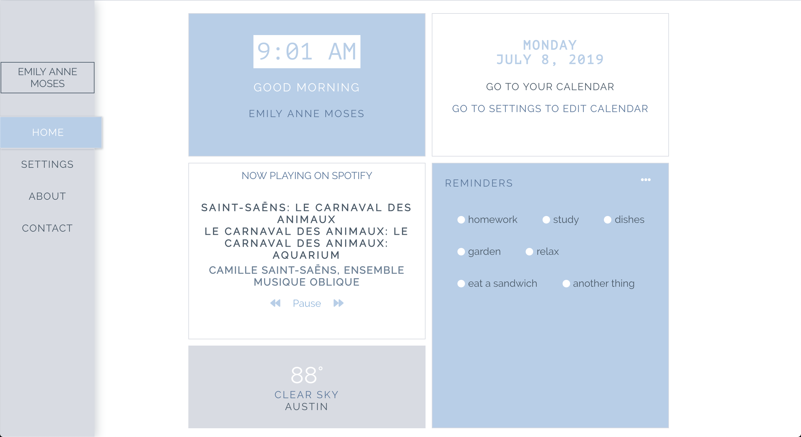

# Dashboard in React

* Home link will display the dashboard containing six components
        
    * Greeting Component saves the name of the user to local storage, this can be edited in `/settings`

    * Time Component shows the users current time

    * Weather Component promps the user to turn on geolocation in their browser, the Weather API grabs the users location and temperature at that location

    * Music Component in `/settings` the user can log in to their Spotify account to listen to their most currently listened to playlist

    * Date / Calendar Component will show the user the current date/day

    * Todo List Component will save each item user adds to to-do list to local storage. Item is deleted from local storage when the radio button is clicked